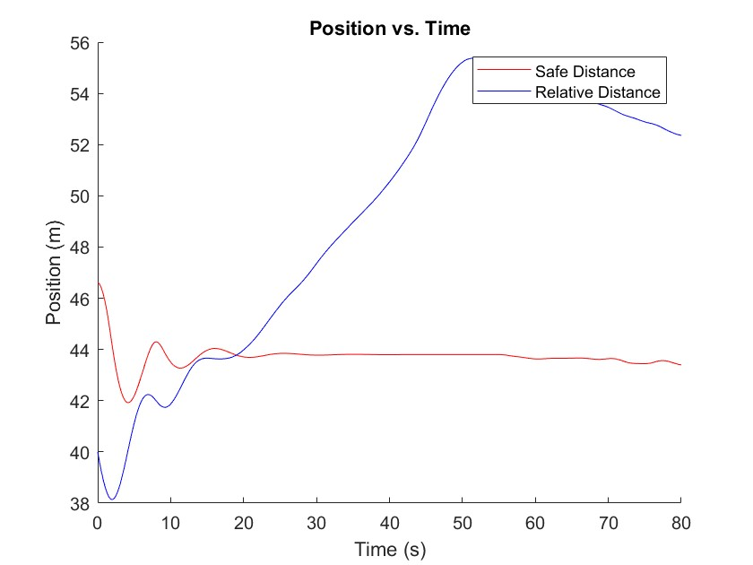
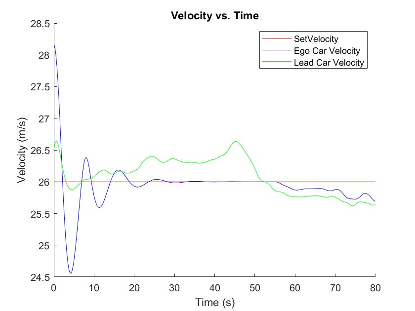
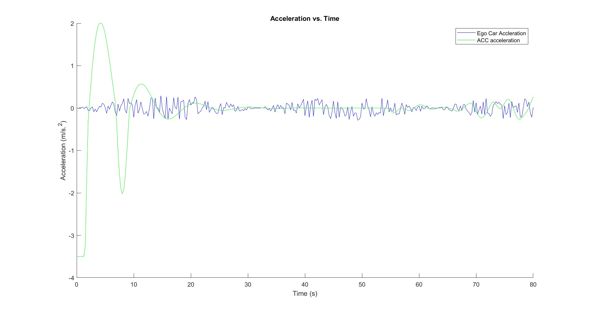
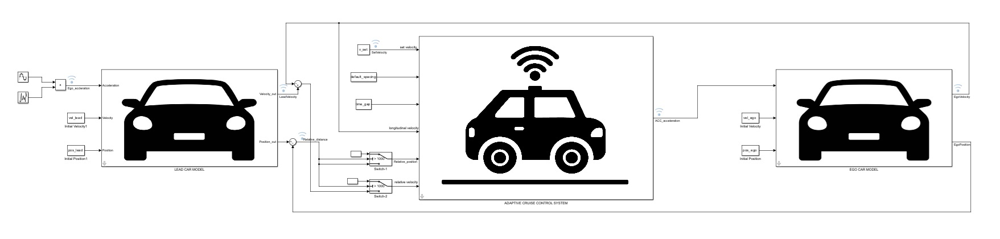

# Adaptive Cruise Control System Using Model Predictive Control

This project implements an Adaptive Cruise Control (ACC) system using Model Predictive Control (MPC) in MATLAB and Simulink. The system simulates a vehicle (Ego Car) following a lead vehicle (Lead Car) while maintaining a safe distance based on velocity and predefined parameters.

## Project Overview

The Adaptive Cruise Control system automatically adjusts the Ego Car's speed to maintain a safe distance from the Lead Car. The system uses:
- Time gap-based distance calculation
- Velocity monitoring and control
- Acceleration and deceleration limits
- Model Predictive Control for optimal performance

## Key Features

- **Dynamic Safe Distance Calculation**: Adjusts following distance based on vehicle speed
- **Velocity Tracking**: Maintains set speed when safe, adjusts when needed
- **Acceleration Control**: Limits acceleration and deceleration for passenger comfort
- **Real-time Response**: Reacts to changing Lead Car behavior

## Simulation Results

### Distance vs. Time Graph

### Velocity vs. Time Graph

### Acceleration vs. Time Graph

### Lead Car Model

## Project Structure

- `code/` - Contains MATLAB script and Simulink model
- `images/` - Contains graphs and visual assets

## How to Run

1. Open MATLAB (R2019b or later recommended)
2. Navigate to the `code` directory
3. Open the `Simulink_model.slx` file
4. Run the `ACC_Script.m` script to execute the simulation
5. View the generated plots to analyze the system performance

## Key Parameters

- Time gap: 1.3 seconds
- Default spacing: 10 meters
- Set velocity: 26 m/s
- Min acceleration: -3.5 m/s²
- Max acceleration: 2 m/s²

## Implemented Control Logic

The control logic implements a Model Predictive Control approach with:
- Position error correction
- Velocity tracking
- Relative velocity compensation
- Acceleration limits for comfort and safety

## Contributors

- [Your Name]
- [Team Member Names if applicable]

## License

This project is licensed under the MIT License - see the LICENSE file for details.  
